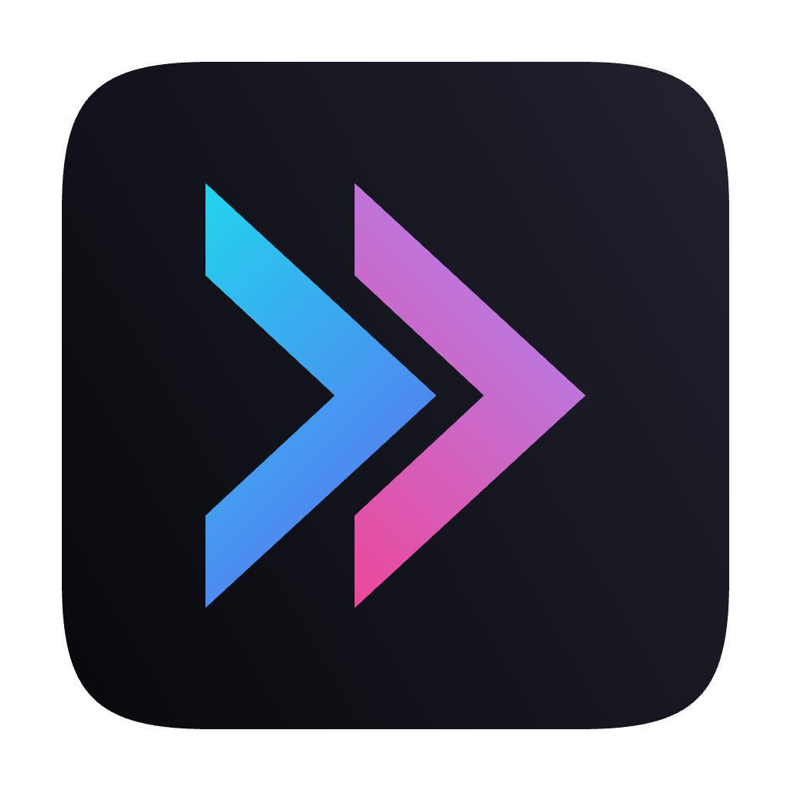

<p align="center">
  
</p>

<h1 align="center">Muxy</h1>

<p align="center">Lightweight and Memory efficient terminal for Mac built with SwiftUI and <a href="https://github.com/ghostty-org/ghostty">libghostty</a>.</p>
<p align="center"><a href="#ios-app-testing">NOW Available on iOS for Testing</a></p>

<div align="center">
  
</div>

## Screenshots


## Features

- **Project-based workflow** — Organize terminals by project with persistent workspace state
- **Vertical tabs** — Sidebar tab strip with drag-and-drop reordering, pinning, renaming, and middle-click close
- **Split panes** — Horizontal and vertical splits with keyboard navigation and resizable dividers
- **Built-in VCS** — Simple and lightweight basic git diff and operations
- **200+ themes** — Browse and search Ghostty themes with a built-in theme picker
- **Customizable shortcuts** — 40+ configurable keyboard shortcuts with conflict detection
- **Workspace persistence** — Tabs, splits, and focus state are saved and restored per project
- **In-terminal search** — Find text in terminal output with match navigation
- **Drag and drop** — Reorder tabs and projects, drag tabs between panes to create splits
- **Auto-updates** — Built-in update checking via Sparkle
- **Text Editor** - Native, Lightweight Text (not code) Editor with code highlight support for most of the programming languages

## Requirements

- macOS 14+
- Swift 6.0+
- Ghostty installed (optional for themes)
- `gh` installed (optional for PR management)

## Install

### Homebrew

```bash
brew tap muxy-app/tap
brew install --cask muxy
```

### Manual

Download the latest release from the [releases page](https://github.com/muxy-app/muxy/releases)

### iOS app (Testing)

The iOS app is available for testers on TestFlight

- Install the iOS app via TestFlight (https://testflight.apple.com/join/7t1AaYHW)
- Open Muxy on your Mac
- Go to Settings (Cmd + `,`)
- Go to Mobile tab
- Toggle the `Allow mobile device connection`
- Open the iOS app
- Enter the IP and Port
- Approve the connection on your Mac
- Test and open issues for the bugs

## Local Development

```bash
scripts/setup.sh          # downloads GhosttyKit.xcframework
swift build               # debug build
swift run Muxy             # run
```

## License

[MIT](LICENSE)
